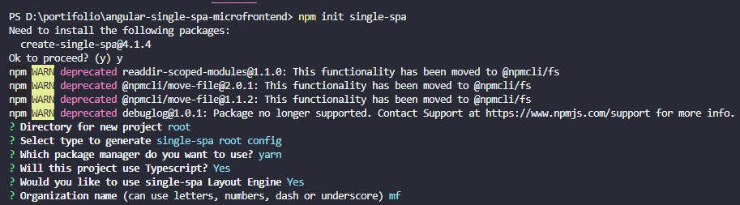
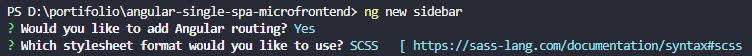
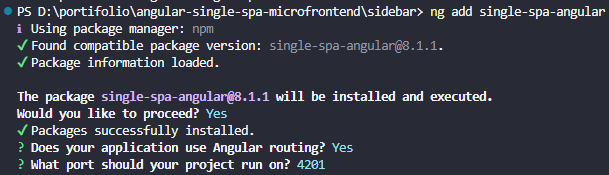
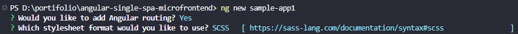
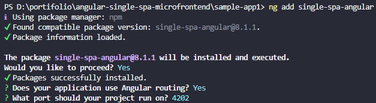
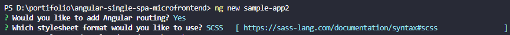
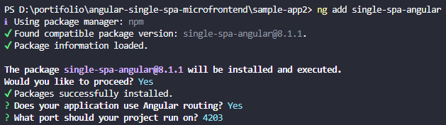

<p align="center">
  
  
</p>

<h1>Microfrontend project sample with <a href="https://angular.io/">Angular</a> and <a href="https://single-spa.js.org/docs/ecosystem-angular">Single Spa</a></h1>

<p>As it is an example project, I reserved the right to place root, sample-app1, sample-app2 and navbar in a single repository, however, in a real situation, each project would be in its proper repository.</p>

<p>Although the use of microfrontends is in vogue, it is necessary to take into account the challenges arising from this architecture. Remember that some difficulties will arise:</p>

- Updating libraries in different projects
- Development and maintenance of components, services, among others that are normally allocated in a shared directory in a library hosted in a private repository
- If it is difficult to maintain standards in a single project, it is much worse in several.
- A limitation of this architecture at the moment is communication between projects. The only way to do this is to create custom events via javascript, subscribe to them and execute them.

<p>The limitations above make me believe that in most scenarios, the microfrontend architecture should not be adopted, giving preference to the monolithic or monorepo structure.</p>

<p>An argument used to defend microfrontends is the isolation of squads and the reduction of the risk of a failure in deployment or in a specific development affecting the entire system. But the question remains: is this a failure of the other architectures, or is it a failure of your process that does not have adequate governance and test coverage?</p>

> Although it is possible to create projects in different frameworks, I wouldn't do this. Again, if it's difficult to maintain standards in a single project with a single framework, imagine having several.

> 

## Table of contents

- [How to execute](#how-to-execute)
- [Folder structure](#folder-structure)
- [How to reproduce application development](#how-to-reproduce-application-development)
    - [Root](#root)
    - [Sidebar](#sidebar)
    - [Sample app 1](#sample-app-1)
    - [Sample app 2](#sample-app-2)
    - [Configurations](#configurations)
- [Todo](#todo)
- [Contributes](#contributes)

## How to use

> For running the application, in different terminals, run the above command within all project folder: root, sidebar, sample-app1 and sample-app2
```shell
yarn start
```

> So, open this url in the browser [http://localhost:9000](http://localhost:9000)
## Folder structure
```
|- root
|- sample-app1
|- sample-app2
|- sidebar
```

- root: contains the single spa application
- sample-app1: contains the sample app 1 application
- sample-app2: contains the sample app 2 application
- sidebar: contains the sidebar application

## How to reproduce application development

### Root

> Run this command in the terminal and answer the configuration questions shown
```shell
npm init single-spa
```


### Sidebar

> Run this command in the terminal and answer the configuration questions shown
```shell
ng new sidebar --prefix sidebar
```


<br />

> Run this command to add the single spa in the sidebar application inside the sidebar folder
```shell
ng add single-spa-angular
```


### Sample app 1
> Run this command in the terminal and answer the configuration questions shown
```shell
ng new sample-app1 --prefix sample-app1
```


<br />

> Run this command to add the single spa in the sample app 1 application inside the sample-app1 folder
```shell
ng add single-spa-angular
```


### Sample app 2
> Run this command in the terminal and answer the configuration questions shown
```shell
ng new sample-app2 --prefix sample-app2
```


<br />

> Run this command to add the single spa in the sample app 2 application inside the sample-app2 folder
```shell
ng add single-spa-angular
```


## Configurations

> In each project (sidebar, sample-app1 and sample-app2) update the AppRoutingModule adding APP_BASE_HREF

```typescript
providers: [
  { provide: APP_BASE_HREF, useValue: '/' },
]
```

> In each project (sidebar, sample-app1 and sample-app2) add EmptyComponent configuration for 404 routes

```typescript
// Update AppModule
@NgModule({
  declarations: [
    EmptyRouteComponent,
    // ...
  ],
  imports: [
    BrowserModule,
    AppRoutingModule
  ],
  providers: [],
  bootstrap: [AppComponent]
})
export class AppModule { }
```

```typescript
// Update AppRoutingModule
const routes: Routes = [
  { path: '**', component: EmptyRouteComponent },
  // ...
];
```

## TODO

- [ ] Develop a template for creating new projects
- [ ] Add husky
- [ ] Add prettier
- [ ] Add eslint
- [ ] Add a conceptual section explaining how the single spa works

## Contributes
If you disagree with any information or think something could be improved, feel free to open an issue and suggest improvements.
